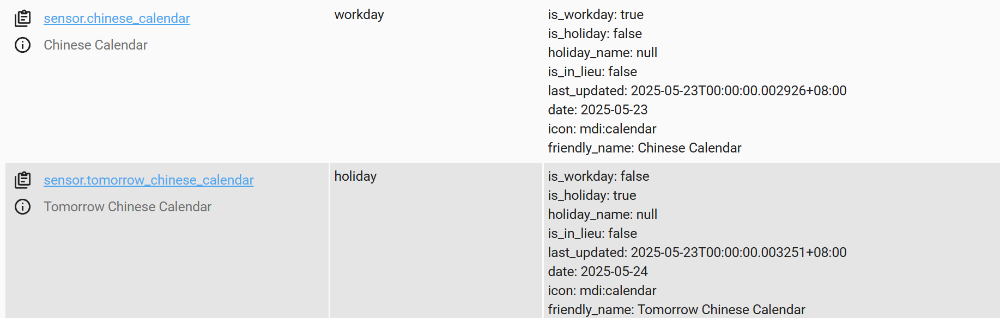

# home-assistant-chinese-calendar

使用 [chinese-calendar](https://github.com/LKI/chinese-calendar) 来判断今天/第二天是否为工作日/节假日。

生成 `sensor.chinese_calendar`和sensor.tomorrow_chinese_calendar 两个 sensor

## 安装

### 手动
将 `custom_components/chinesecalendar` 目录复制到你的 Home Assistant 配置文件夹的 `custom_components` 目录下（如果没有该目录，则手动创建一个）。
参考： https://developers.home-assistant.io/docs/en/creating_component_loading.html

### HACS
支持HACS添加本仓库

## 配置
在/homeassistant/configuration.yaml里添加如下配置
```yaml
sensor:
  - platform: chinesecalendar
```

## 截图


